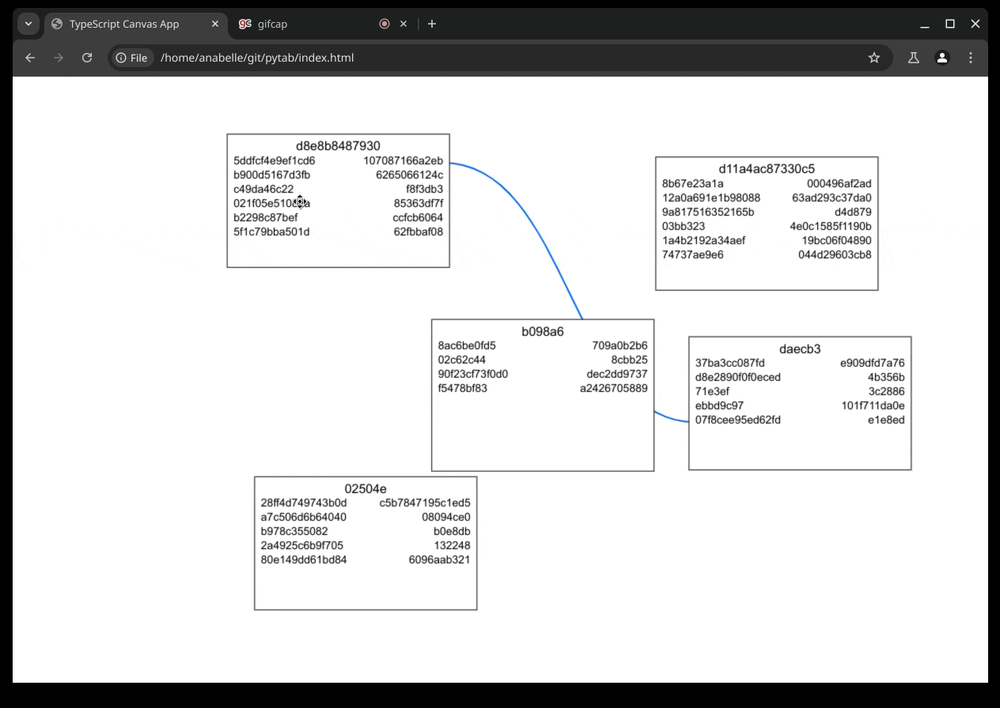

# Demo

# Goal
to get an interactive extension that shows the relationship between objects
first, for python, and eventually for other languages too.

It currently uses cursorless's parse tree to comb through a file. The functions to take the AST and create a diagram are still WIP.

# Next Steps
Diagram.ts is fairly okay
biggest thing to do is to take a hard look at `extension2.ts` and figure out what's working, what's broken.

Features to implement:
- `vscode://` hyperlinks for the rectangles
- zooming in/out with mousewheel should not change font, it does rn.
- support vscode theme css variables
